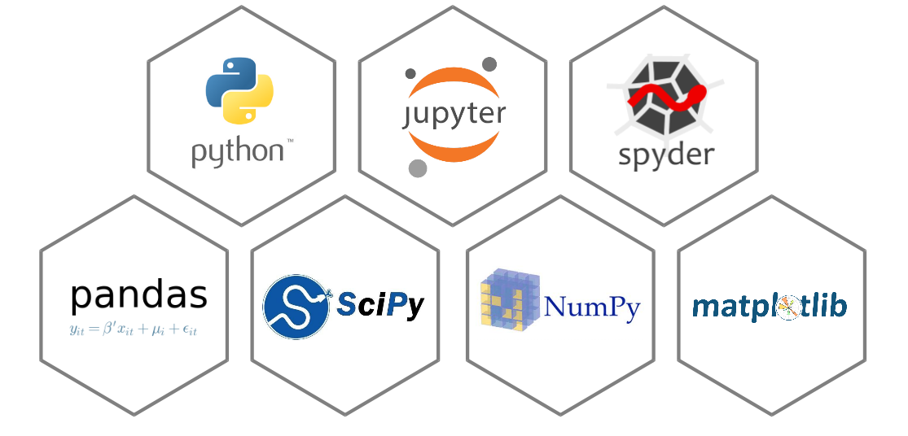
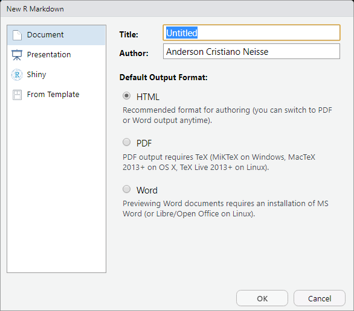
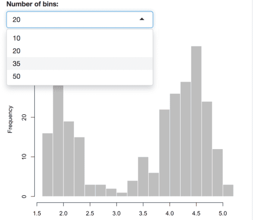

```{r setup, include=FALSE}
options(htmltools.dir.version = FALSE)
```

# O que é? 

.pull-left[
- Pacote que gera documentos;

- Mistura:

  - Códigos e resultados do R;
  
  - Texto: LaTeX, Markdown.
  
- Permite criar:

  - Documentos interativos;
  
  - Sites HTML(`blogdown`);
  
  - Dashboards (`shiny`);
  
  - [Muitos outros](https://rmarkdown.rstudio.com/gallery.html).
]

.pull-right[

]

[Markdown](https://en.wikipedia.org/wiki/Markdown) é uma linguagem para fácil escrita de documentos em HTML.

---
# Onde vive? 

.pull-left[

]

.pull-right[
- Pacote criado pelo [RStudio](https://www.rstudio.com/);


- Lançado em 17/Set/2014;


- Hospedagem: 
  - CRAN;
  
  - [Github](https://github.com/rstudio/rmarkdown);
  
- [R Markdown: The Definitive](https://bookdown.org/yihui/rmarkdown/):
  - Livro detalhado;
  
  - Autora do pacote.
]

Não é necessário o RStudio para usar o `rmarkdown`. 

Mas seu uso facilita muito criação de documentos.

---
# Do que se alimeta?

.pull-left[
- Com o `knitr` mistura:
  - Textos em Markdown;
  
  - Textos em LaTeX;
  
  - Resultados e Códigos R;
  
  - Também outras linguagens.
  

- Usa pandoc para gerar formatos como
  - HTML5;
  
  - PDF;
  
  - MSOffice;
  
  - [E outros](https://rmarkdown.rstudio.com/formats.html).
]

.pull-right[

]

[Pandoc](https://pandoc.org/) é um conversor de documentos gratuito e de código aberto.

---

# Em resumo:

A idéia base é muiuto simples:
  
  - Intercalar narrativa com código em um documento;
  
  - "Tricotar" o documento gerando resultados a partir do código;
  
  - Então você têm seu relatório pronto.

--
  
Entretanto esta idéia não foi criada pelo `rmarkdown`:

  - Surgiu de um paradigma de programação por Knuth (1984);
  
  - Termo: Programação Literal (*Literate Programming*).

--

Outras ferramentas também usam, como o [Jupyter Notebook](https://jupyter.org/) (Python).

```{r, echo=FALSE, out.height=170, out.width=400, fig.align='center'}

```


---
class: inverse, center, middle

# Use cases

### Como R Markdown é útil?

---

# Airbnb

Documentam todas as análises em R com o R Markdown.
 
Relatórios finais são revisados e mantidos em repositório de conhecimento.
  
```{r, out.height=200, out.width=150, echo=FALSE, fig.align='center'}
knitr::include_graphics("https://logodownload.org/wp-content/uploads/2016/10/Airbnb-Logo-9.png")
```
--


Todas as áreas podem consultar, analisar e reproduzir resultados passados.

--

Também permite aos Cientistas de Dados a:
  - Aprenderem com análises anteriores;
  
  - Reproduzirem resultados.


---

# E-mails personalizados

O R Markdown permite gerar relatórios com programação!

**Mine Çetinkaya-Rundel** quis criou mensagens personalizadas para um Workshop.


```{r, out.height=200, out.width=350, echo=FALSE, fig.align='center'}
knitr::include_graphics("https://imageog.flaticon.com/icons/png/512/60/60543.png?size=1200x630f&pad=10,10,10,10&ext=png&bg=FFFFFFFF")
```

--

Ela usou um template em R Markdown dentro de um `for()` e gerou 20 PDFs.

Cada um com informações individuais e comuns entre os participantes.

--

Detalhes técnicos de como ela fez [aqui](https://rmarkdown.rstudio.com/articles_mail_merge.html)!

---

# Outros

### Artigos Científicos

Chris Hartgerink escreveu um [post](https://elifesciences.org/labs/cad57bcf/composing-reproducible-manuscripts-using-r-markdown) explicando como gerou um artigo dinamicamente com R Markdown e muito LaTeX.

--

### Livros (`bookdown`)

  - [R for Data Science](https://r4ds.had.co.nz/) - Introduz o R na abordagem "`tidyverse`" para análise de dados;
  - [Advanced R](https://adv-r.hadley.nz/) - Base e conceitos avançados em R;
  - [Text Mining with R](https://www.tidytextmining.com/) - Técnicas de extração de informação de texto.
  
--
  
### Websites (`blogdown`)

Disponibiliza várias possibilidades de sites a serem criados em R Markdown.
  
  - [blogdown: Creating Websites with R Markdown](https://bookdown.org/yihui/blogdown/).

---
class: inverse, center, middle

# Instalação e Início

---
# Instalando


A instalação do pacote pode ser feita da maneira tradicional:

```{r eval=FALSE, tidy=FALSE}
install.packages("rmarkdown")
```

--

Ou, por meio do [Github](https://github.com/rstudio/rmarkdown):

```{r, eval=FALSE, tidy=FALSE}
install.packages("devtools")
devtools::install_github("rstudio/rmarkdown")
```

--

A segunda opção instala a versão de desenvolvedor a partir do Github.

Pode trazer melhorias ainda não submetidas ao CRAN, assim como possíveis bugs.

---

# Criando documentos

É recomendado o uso do [RStudio IDE](https://www.rstudio.com/products/rstudio/), mas não obrigatório.

O **RStudio** traz muitas facilidades como atalhos e comandos de compilação.

--

- Crie um novo documento R Markdown no menu `File -> New File -> R Markdown`;
  
  - Cria um script com a estrutura já digitada.

```{r, echo=FALSE, out.height=200, out.width=200, fig.align='center'}

```

--

- Clique no botão `knit` para compilar o exemplo (`Ctrl + Shift + K`).
  
  - Roda o comando `rmarkdown::render()` em **nova sessão**;
  

---

# Metadados YAML

O cabeçalho de todo documento `.Rmd`.

Traz as informações usadas para renderizar o documento.

```{r, eval=FALSE}
---
title: "Documento Qualquer"
author: "Anderson Neisse"
date: "23/02/2019"
output: 
  html_document:
    toc: true
    toc_depth: 2
---
```

--

YAML significa "Yet Another Markup Language".

É uma linguagem que representa dados em formato de listas.

Usa **identação** para identificar níveis de aninhamento.

---
# Opções de formato

Existem basicamente dois tipos de R Markdown: Documento e Apresentação.

Na possibilidade de mais de um formato, o botão `knit` mostrará opções:

```{r, echo=FALSE, fig.align='center'}
knitr::include_graphics("https://bookdown.org/yihui/rmarkdown/images/format-dropdown.png")
```

--

Basicamente, o `output` do YAML é alterado.

Pacotes de extensão podem introduzir novos formatos, como o `tufte`.

O RStudio tem uma página de [Referência de Formatos](https://rmarkdown.rstudio.com/formats.html).

---
class: inverse, center, middle

# Sintaxe Markdown

### A implementação Pandoc

---
# Formatação de texto

As principais funcionalidades são:

  - **Negrito** usando `**Negrito**` ou `__Negrito__`;
  
  - *Itálico* usando `*Itálico*` ou `_Itálico_`;
  
  - ~~Cortado~~ usando `~~Cortado~~`;
  
  - [Link](https://aneisse.com/) usando `[Link](https://www.link.com)`;
  
  - Imagem usando "" ou:

```{r, eval=FALSE}
# Este método permite opções de escala e posição da imagem no {r}
knitr::include_graphics("caminho ou link")
```

O RStudio tem documento de [referência de R Markdown](https://www.rstudio.com/wp-content/uploads/2015/03/rmarkdown-reference.pdf).

---
# Listas

Podemos criar listas com `-`, `+` ou `*`:

```{r, eval=FALSE}
  - Item 
    - Subitem
  - Outro item
```

  - Item 
    - Subitem
  - Outro item

--

Ou listas ordenadas com `1., 2., ...`:

```{r, eval=FALSE}
  1. Item
    + Subitem
  2. Outro item
```

  1. Item
    + Subitem
  2. Outro item

---

# Texto em blocos e citações

Texto após o operador `>` fica em um bloco:

```{r, eval=FALSE}
> "I thoroughly disapprove of duels. If a man should challenge me,
  I would take him kindly and forgivingly by the hand and lead him
  to a quiet place and kill him."
>
> --- Mark Twain
```

> "I thoroughly disapprove of duels. If a man should challenge me,
  I would take him kindly and forgivingly by the hand and lead him
  to a quiet place and kill him."
>
> --- Mark Twain

--

Ou blocos de código em geral com identação de quatro `tabs`/`espaços`:

```{r, eval=FALSE}
        Este texto será gerado em fonte de código
```


        Este texto será gerado em fonte de código.


---
# Definição de Seções

A criação de seções usa Markdown como base:

```{r}
# Seção
```
# Seção

```{r}
## Sub-seção
```
## Subseção

```{r}
### Sub-sub-seção
```
### Sub-sub-seção

---
# Equações

Equações na linha podem ser escritas dentro de um par de cifrões `$` em LaTeX:

`${n \choose k} p^{k} (1-p)^{n-k}$` retorna ${n \choose k} p^{k} (1-p)^{n-k}$

--

Equações multi-linha devem ser envolas em cifrões duplos `$$`:

```{r, eval=FALSE}
$$
  {n \choose k} p^{k} (1-p)^{n-k}
$$
```

retorna

$${n \choose k} p^{k} (1-p)^{n-k}$$
---
class: inverse, center, middle

# Códigos e Resultados em R
### Chunks (Pedaços) de código
---
# Códigos R

Todo código em R deve ser insrido em *chunks* (pedaços). 

### Código multi-linha

Atalho: `Ctrl + Alt + i`.

```{r, out.height=400, out.width=400}
#Código dentro de um chunk
mean(1:10)
```

--

### Código na linha (texto dinâmico):
  
```{r}
# Texto anterior `r código` texto posterior.
```

Este valor foi calculado na geração do documento com `mean(1:10)`: `r mean(1:10)`.

Permite muitas possibilidades de relatórios dinâmicos.

---
# Opções de código

Existem opções para códigos no relatório:

  - `{r, echo = FALSE}`: Não mostra o código, somente o resultado;
```{r, echo=FALSE}
mean(1:10)
```

  - `{r, eval = FALSE}`: Não roda o código, só o mostrando;
```{r, eval=FALSE, }
mean(1:10)
```

  - `include = FALSE`: Remove tanto código quanto resultados, mas roda;

  - `warning = FALSE` não mostrará warnings no relatório compilado;
  
  - `message = FALSE` não mostrará mensagens (carregamento de pacotes).
  
  - [Várias outras](https://yihui.name/knitr/options/).

---
# Imagens

Gráficos serão mostrados logo abaixo do chunk:

```{r, out.width=300, out.height=300, fig.align='center'}
plot(1:10)
```

Também podemos usar `knitr::include_graphics("caminho ou link")` para inserir figuras.

---
# Opções de Imagens

Também existem pções de imagens dentro de `{r}`, como:

  - `out.height` e `out.width`: Ajusta dimensões da imagem no relatório.
  
  - `fig.align`: Ajusta alinhamento direito, esquero, centralizado;

  - `fig.cap`: Inserção de título da imagem;
  
```{r, echo=FALSE, out.width=125, out.height=125, fig.align='center',fig.cap="Figura 1."}
plot(1:10)
```
  
  - `fig.pos`: Equivalente a posicionamento de figuras do LaTeX;
  

Outras opções de figuras são explicadas [aqui](https://bookdown.org/yihui/rmarkdown/r-code.html#figures).

---
# Outras linguagens

O RStudio faz API com outras linguagens instaladas.

Pode ser inseridos códigos de outras linguagens como:

  - Python: {python}, usando o apcote `reticulate`;
  
  - SQL: {sql}, precisa de conexão com o BD;
  
  - JavaScript: {sql}, ajuda a formatar documentos HTML;
  
  - [E outras](https://bookdown.org/yihui/rmarkdown/language-engines.html#javascript-and-css).

--

### Exemplo de python
  
```{python}
import numpy as np # Importa biblioteca de computação numérica
b = np.arange(4).reshape(2,2) # Cria sequência e muda dimensões
print(b) # Imprime
```

---
class: inverse, center, middle

# Documentos interativos

### Widgets HTML e Shiny

---
# Widgets HTML

Os Widgets HTML sáo implementados no R pelo pacote `htmlwidgets`.

O pacote usa JavaScript para criar gráficos e tabelas interativas.

--

Pacotes resultantes desta interface são:

  - `DT`: Cria tabelas interativas com filtros e paginação;
  
  - `plotly`: Gráficos interativos a partr do `ggplot2`;
  
  - `leaflet`: Mapas dinâmicos; 

--

Podem ser incorporados em documentos e apresentações.

Mais pacotes de Widgets HTML podem ser encontrados [aqui](https://www.htmlwidgets.org/showcase_leaflet.html).


---
# Widgets HTML - `DT`

Para inserir data frames como WIdget HTML basta inserir:

```{r, warning=FALSE}
library(DT)
datatable(iris, options = list(pageLength = 4))
```


Para mais tipos de opções de formatação da tabela, [aqui](http://rstudio.github.io/DT/).

---
# Widgets HTML - `leaflet`

Pacote frequentemente utilizado para criar mapas.

Outra opção é o `ggmap`, extensão do `ggplot2`, [aqui](https://github.com/dkahle/ggmap).

O código abaixo usa o dataset `quake` para gerar um exemplo.

```{r, eval=FALSE, warning=FALSE, message=FALSE}
library(leaflet)
leaflet(quakes) %>% addTiles() %>% 
  addMarkers(clusterOptions = markerClusterOptions())
```

Para mais detalhes em diferentes formas de plots em `leaflet`, [aqui](https://rpubs.com/mattdray/basic-leaflet-maps).

---
# Widgets HTML - `leaflet`

```{r, echo=FALSE, warning=FALSE, message=FALSE, fig.align='center'}
library(leaflet)
leaflet(quakes) %>% addTiles() %>% 
  addMarkers(clusterOptions = markerClusterOptions())
```

---

# Widgets HTML - `plotly`

Pacote mais utilizado para gráficos inteativos. Possui biblioteca no python também.

Gera um gráfico interativo em HTML a partir do `ggplot2`.

--

Deve-se gerar o gráfico no `ggplot2`:

```{r}
library(ggplot2)
g <- ggplot(iris, aes(x = Petal.Length, y = Petal.Width)) +
  geom_point(aes(color = Species)) + 
  labs(title = "Tamanho da pétala por espécie de flor", 
       x = "Comprimento", y = "Largura", color = "Espécie") + 
  theme_bw()
```

--

Então utilizar a função `plotly::ggplotly()` no gráfico:

```{r, eval=FALSE}
library(plotly)
ggplotly(g)
```

Mais sobre gráficos com `plotly` pode ser encontrado [aqui](https://plot.ly/r/).

---
# Widgets HTML- `plotly`

```{r, echo=FALSE, warning=FALSE, message=FALSE, error=FALSE}
library(plotly)
ggplotly(g)
```

---

# Documentos Shiny

Shiny é uma biblioteca focada em criar dashboards interativos.

Roda aplicativo em background, que recebe as solicitações do usuário e renderiza.

```{r, eval=FALSE}
selectInput(
  'breaks', label = 'Number of bins:',
  choices = c(10, 20, 35, 50), selected = 20
)

renderPlot({
  par(mar = c(4, 4, .1, .5))
  hist(
    faithful$eruptions, as.numeric(input$breaks),
    col = 'gray', border = 'white',
    xlab = 'Duration (minutes)', main = ''
  )
})
```

Mais informações em Shiny podems er encotnradas [aqui](https://shiny.rstudio.com/tutorial/).

---
# Documentos Shiny

O exemplo do slide anterior gera:

```{r, echo=FALSE, fig.align='center', out.height=425, out.width=425}

```

--


Com conexão à internet, podemos ver exemplos [na prática](https://shiny.rstudio.com/gallery/movie-explorer.html).

---

class: left

# Referências

- Allaire, J. J., Ushey, K., Tang, Y., Eddelbuettel, D., Lewis, B., & Geelnard, M. (2018). reticulate: interface to’Python’. R package version, 1(8).

- Bion, Ricardo, Robert Chang, and Jason Goodman. "How R helps Airbnb make the most of its data." The American Statistician 72.1 (2018): 46-52.

- Cheng, J., Karambelkar, B., Xie, Y., Wickham, H., Russell, K., & Johnson, K. (2018). Leaflet: create interactive web maps with the JavaScript “Leaflet” Library [Internet]. 2017.

- Knuth, Donald E. 1984. “Literate Programming.” The Computer Journal 27 (2). British Computer Society: 97–111.

- Wickham, Hadley. ggplot2: elegant graphics for data analysis. Springer, 2016.

- Xie, Yihui, Joseph J. Allaire, and Garrett Grolemund. R markdown: The definitive guide. CRC Press, 2018. [Disponível online](https://bookdown.org/yihui/rmarkdown/).

---

class: center, middle

# Obrigado!


Apresentação criada com o pacote [**xaringan**](https://github.com/yihui/xaringan).

[aneisse.com](https://aneisse.com/)

Twitter: [@a_neisse](https://twitter.com/a_neisse)

LinkedIn: [anderson-neisse](https://www.linkedin.com/in/anderson-neisse/)
